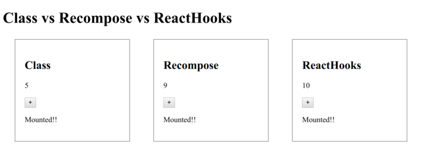

# class-recompose-hooks

**Description**

- Comparison of how to write ContainerComponent with Class, Recompose and Hooks
- Each code is in the `/src/Containers/`

**Preview**

||
|:-:|

**How to check UI**

1. execute `$ npm run dev`
2. access to `http://localhost:8080/` with Web browser

**How to build**

1. execute `$ npm run build`
2. files are created in `/dist/`
